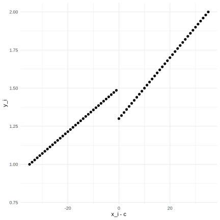
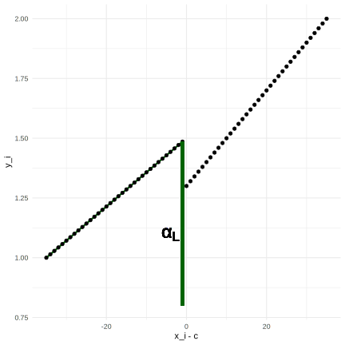
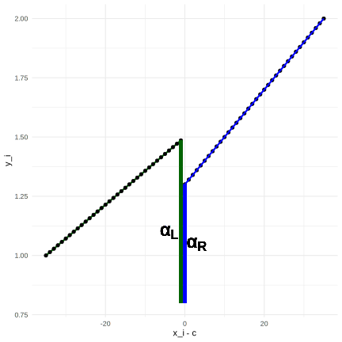
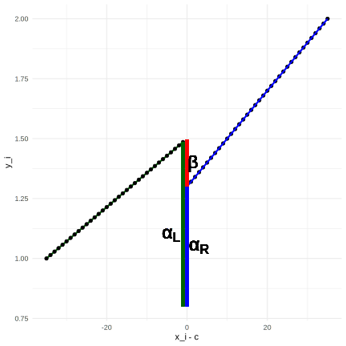
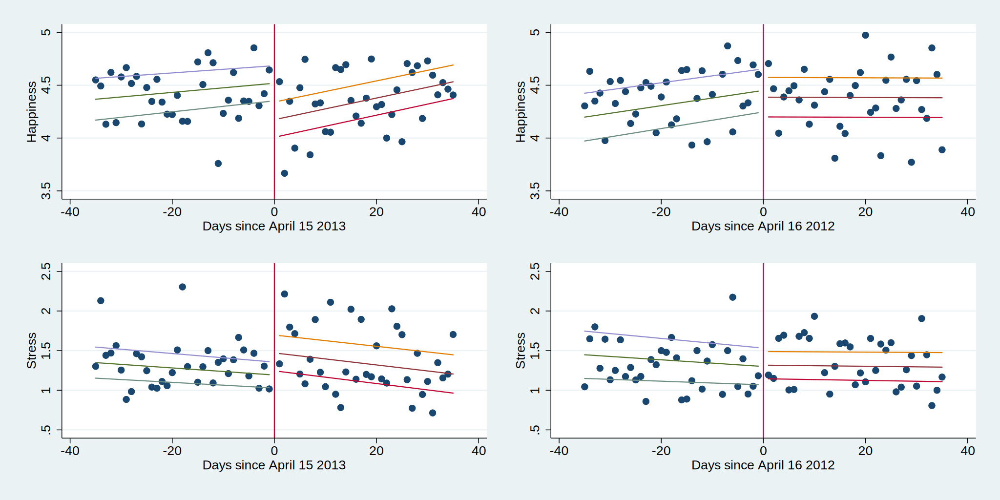
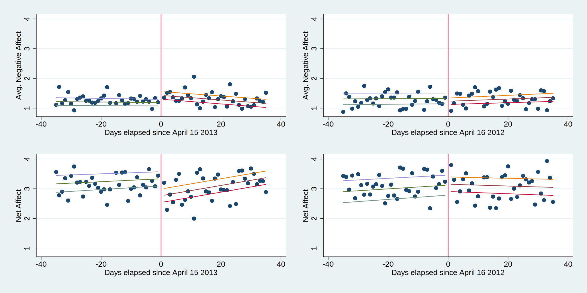
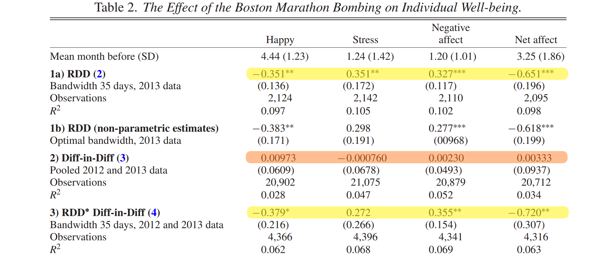
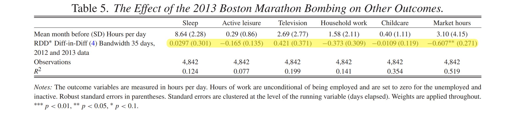
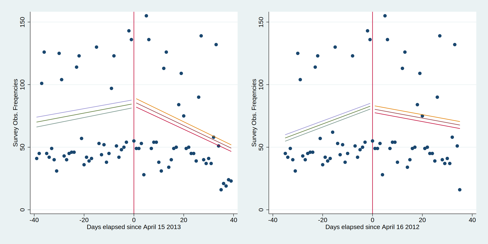
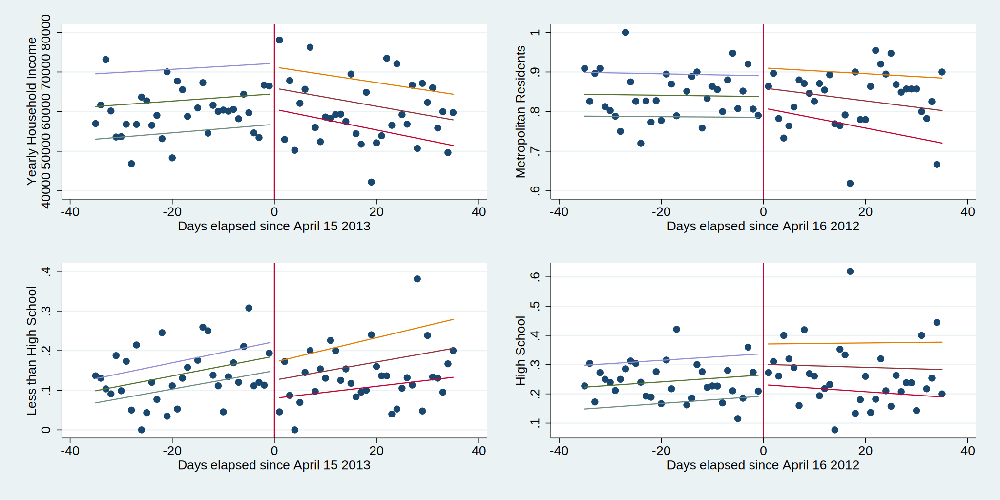

```{r setup, include=FALSE}
options(htmltools.dir.version = FALSE)

source("presentation_backend.R")

```

# Introduction: Research Interest

## Effect of terrorism on outcomes such as:
- **Wellbeing**
    - Happiness
    - Stress
    - Negative affect
    - Net affect (happiness - negative affect)
- **Time allocation**
    - Market hours
    - Household Work
    - Childcare
    - Active Leisure
    - Watching TV or listening to Media
    - Sleep

---

# Introduction: Big Picture

Time-Series of data around 2013 Boston Marathon Bombing

Focus on *individual* rather than *aggregated* consequences

Research on terrorism needs to account for:
- Non-random timing of attacks
- Short-lived effects

Approaches:
- Synthetic control groups
- Difference-in-Differences (`DiD`)
- Regression Discontinuity Design (`RDD`)

---

# Introduction: Contribution

First study on the effect on individual wellbeing of this event

--

**Problem:** Neither `RDD` nor `DiD` work here
- `RDD`: Overlap of marathon and bombing effects
- `DiD`: Effects are too short-lived

Clark et al.(2020) provide their own event study: effects last for *one week*

--

**Solution:** Combined `RDD` and `DiD` model

Difference in `RDD` effects between 2012 (control group) and 2013 (treatment group)


---

class: inverse, center, middle

# Empirical Approach

<html><div style='float:left'></div><hr color='#EB811B' size=1px width=960px></html> 

RDD, Local-Linear Regression and DiD

---

# Data and Setup

**Data:** American Time Use Survey + Well-Being module (BLS 2020)
- 4842 observations (ca 50/50 in 2012 and 2013)
- $\pm$ 35 days around the marathon
- Code and Data freely available [here](https://oup-silverchair-cdn-com.emedien.ub.uni-muenchen.de/oup/backfile/Content_public/Journal/ej/130/631/10.1093_ej_ueaa053/1/ueaa053_replication_package.zip?Expires=1641220701&Signature=ZR25ucu0F~5jamhDR3CE9i4jILeq-pKC1PkC4HiyV6KUIwBl-GGTwG8gAmoI8K9oRkGKnZ1mtzQ59TEvAdlY~X-I5He6Zd29k5dGukxVj-57X2iWfbJH3QGDsgE5IrPF6CmaLRvdM1iM8MFqTusjU2btwQhxIBh0zr2KQr2VQDeCCReSCv55bB0ekOlUNte-Smlr3tGan5UOngspb3feHQtcvLX9EJQ1A~VM~BZL06v8Xq2ftbwwe~wW7CFj5dSPzzIGjiELtkHurKjtwPlL1QqOuKV~uhT9BMSdoIGiKEgX8nfVIjzhsK39ua54O8~XDLe1vbNbuPcGPr2NqWqXnQ__&Key-Pair-Id=APKAIE5G5CRDK6RD3PGA)

--

**Outcomes:** Daily wellbeing and time-use reports $y_i$

**Runnning variable:** Time distance to Marathon $D_i = x_i - c$ 

**Exposure to treatment:** Deterministic in time, via exposure through media
$\Rightarrow$ `Sharp RDD`

$$T_i = \begin{cases}
0 & \text{for } x_i \geq c \\
1 & \text{for } x_i < c
\end{cases}$$

$y_i = \beta \cdot T_i + f(D_i) + u_i$ is implemented as `Local Linear Regression`

---

# Local Linear Regression

.left-col[

]

.right-col[

Limit `bandwidth` around the event (here: 35 days)

]
---

# Local Linear Regression

.left-col[

]

.right-col[

Limit `bandwidth` around the event (here: 35 days)

Combine seperate regressions for left and right side:

$$\begin{aligned}
y_i = &\big[\alpha_{L} + \sigma_L D_i + u_i\big] \cdot (1-T_i)
\end{aligned}$$

]


---

# Local Linear Regression

.left-col[

]

.right-col[

Limit `bandwidth` around the event (here: 35 days)

Combine seperate regressions for left and right side:

$$\begin{aligned}
y_i = &\big[\alpha_{L} + \sigma_L D_i + u_i\big] \cdot (1-T_i) \\
&+ \big[\alpha_R + \sigma_R D_i + u_i \big] \cdot  T_i \\
\end{aligned}$$

]

---

#Local Linear Regression

.left-col[

]

.right-col[

Limit `bandwidth` around the event (here: 35 days)

Combine seperate regressions for left and right side:

$$\begin{aligned}
y_i = &\big[\alpha_{L} + \sigma_L D_i + u_i\big] \cdot (1-T_i) \\
&+ \big[\alpha_R + \sigma_R D_i + u_i \big] \cdot  T_i \\
= &\alpha_L + \underset{\beta}{\underbrace{(\alpha_R - \alpha_L)}} T_i \\
&+ \sigma_LD_i \cdot (1-T_i) \\
&+ \sigma_RD_i \cdot T_i \\
&+ u_i
\end{aligned}$$

]

---

# Identification: Problem

Wellbeing and time-use may be affected by multiple events:
- Boston Marathon 
- 2013 Attack


Effects might *cancel out* or *add up* $\Rightarrow$ **biased treatment estimate**

--

**Solution:** Use 2012 Boston Marathon as control group.

$$Year_i = \begin{cases}
0 & \text{for 2012} \\
1 & \text{for 2013} 
\end{cases}$$

This imports the usual `DiD` assumptions

Also introduce control variables to account for population differences between 2012 and 2013

---

# Identification: Solution

Again, we just combine regressions using a dummy:

$$\begin{aligned}
y_i &= \left[\alpha_{LC} + \beta_C T_i  + \sigma_{LC}D_i \cdot (1-T_i)  + \sigma_{RC}D_i \cdot T_i  + u_i \right] (1-Year_i) \\
& +\left[\alpha_{LT} + \beta_T T_i  + \sigma_{LT}D_i \cdot (1-T_i)  + \sigma_{RT}D_i \cdot T_i  + u_i \right] (Year_i)
\end{aligned}$$

---
# Identification: Solution

Again, we just combine regressions using a dummy:

$$\begin{aligned}
y_i &= \left[\alpha_{LC} + \beta_C T_i  + \sigma_{LC}D_i \cdot (1-T_i)  + \sigma_{RC}D_i \cdot T_i  + u_i \right] (1-Year_i) \\
& +\left[\alpha_{LT} + \beta_T T_i  + \sigma_{LT}D_i \cdot (1-T_i)  + \sigma_{RT}D_i \cdot T_i  + u_i \right] (Year_i)
\end{aligned}$$


Rewritten:
$$\begin{aligned}
y_i &= \alpha_{LC} + (\alpha_{LT} - \alpha_{LC}) Year_i + \beta_CT_i + \underset{\text{RDD-DiD Estimator}}{\underbrace{(\beta_T - \beta_C)T_i\cdot Year_i}} \\
&+ \sigma_{LC}D_i(1-T_i)(1-Year_i) \\
&+ \sigma_{RC}D_i(T_i)(1-Year_i) \\
&+ \sigma_{LT}D_i(1-T_i)(Year_i) \\
&+ \sigma_{RT}D_i(T_i)(Year_i) \\
&+ u_i
\end{aligned}$$
---

class: inverse, center, middle

# Main Results

<html><div style='float:left'></div><hr color='#EB811B' size=1px width=960px></html> 


---

# Effects on Well-Being: Happiness & Stress

.center[

]

---

# Effects on Well-Being: Negative and Net Affect

.center[

]

---

# Effects on Well-Being: More Stuff

.center[

$^{***}\;p<0.01 \qquad ^{**}\;p<0.05 \qquad ^*\;p<0.1$
]

---

# Effects on Time Use: Regression Results

.center[

]

--

## Effects for different populations:

- *Mens* *and* rural peoples affects were *not* affected
- People from *nearer states* were stronger affected (2x)
    - Counterevidence to previously found spillovers
- No effects for *education*

---

# Conclusion and Summary

New method to find effects for coinciding events: `RDD DiD`

Shortcomings:
- No formal identification proof (*does it need one?*)
- No discussion of `DiD` assumtpions, i.e. *parallel trends* 
- Only one control group (2012) (*there are more years*)

---

# References

**BLS** (2020). *American Time Use Surves (ATUS)*. URL: [https://www.bls.gov/tus/](https://www.bls.gov/tus/)

**Clark et al.** (2020). *Clark et al.(2020): The impact of Terrorism on Individual Well-Being. Evidence from the Boston Marathon Bombing*. The Economic Journal, 130, 2065-2104. [https://doi.org/10.1093/ej/ueaa053](https://doi.org/10.1093/ej/ueaa053)

---

class: inverse, center, middle

# Appendix

<html><div style='float:left'></div><hr color='#EB811B' size=1px width=960px></html> 

RDD, Local-Linear Regression and DiD

---

# Checking for Manipulation: Survey Frequency

.center[

]

---

# Checking for Manipulation: Other Controls

.center[

]
